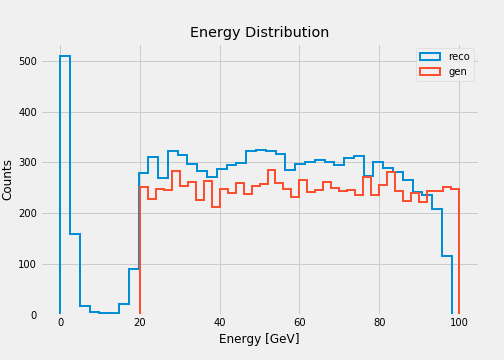
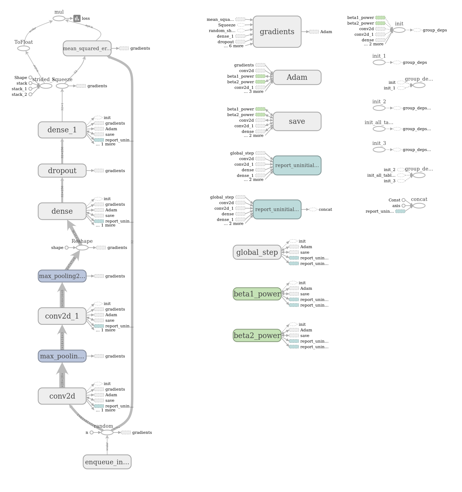
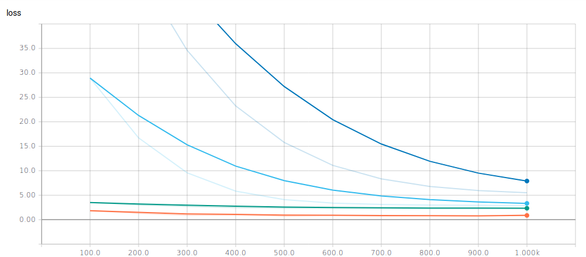
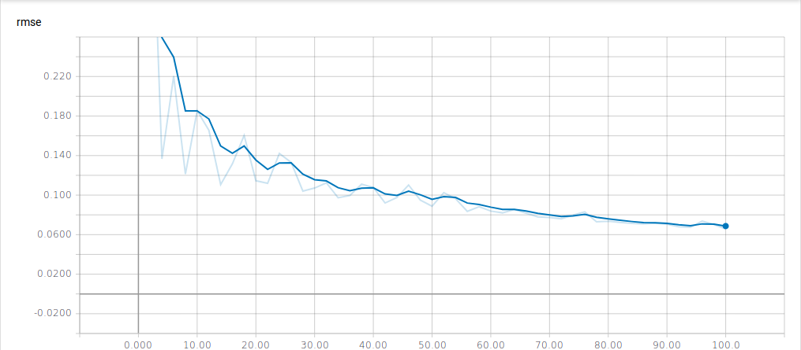

# Energy Regression
The regression study intends to train a model that determines the energy of a calorimetric image.

The resuls shown below correspond to the sample `eplus_Ele-Eta0PhiPiOver2-Energy20to100_V2.npy`.

## Model Evaluation
According to the RMSE metric the convolutional model outperforms the shallow model.

<table>
  <tr>
    <th colspan="6">RMSE results</th>
  </tr>
  <tr>
    <td>Model \ Energy threshold</td>
    <td>0 GeV</td>
    <td>10 GeV</td>
    <td>20 GeV</td>
    <td>30 GeV</td>
  </tr>
  <tr>
    <td><a href="https://github.com/jruizvar/ml-physics/blob/master/python/custom_models.py#L6-L21">Shallow NN</a></td>
    <td>0.194</td>
    <td>0.177</td>
    <td>0.485</td>
    <td>0.351</td>
  </tr>
  <tr>
    <td><a href="https://github.com/jruizvar/ml-physics/blob/master/python/custom_models.py#L24-L59">Convolutional NN</a></td>
    <td>0.122</td>
    <td>0.068</td>
    <td>0.077</td>
    <td>0.075</td>
  </tr>
</table>

## TensorBoard Graph

## Learning Curve
The blue (orange) curve corresponds to the validation (training) sample.

## Root Mean Squared Error (RMSE)

## Python Modules

## [custom_dataset.py](python/custom_dataset.py)
- Create a dataset of training and validation examples with simulations of the CMS electromagnetic calorimeter.

## [custom_models.py](python/custom_models.py)
- Create models in [TensorFlow](https://www.tensorflow.org).

## [custom_estimator.py](python/custom_estimator.py)
- Build a regression model using [tf.estimator](https://www.tensorflow.org/api_docs/python/tf/estimator) API.
