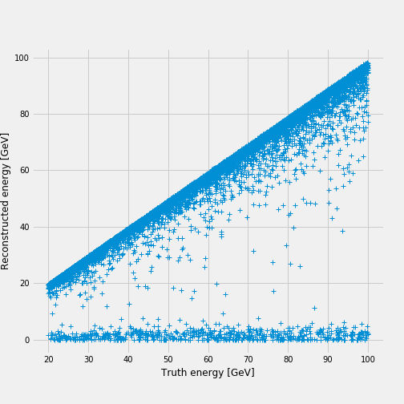

# Energy Regression

The goal is to train a regression model that minimizes the experimental error
associated with the energy reconstruction in the CMS electromagnetic calorimeter.

The results are based on the simulated sample

- `eplus_Ele-Eta0PhiPiOver2-Energy20to100_V2.npy`.

The root mean squared error [RMSE](python/custom_estimator.py#L58) measures
the discrepancy between the reconstructed energy and the generated value.

## Machine Learning Models

<table>
  <tr>
    <th>Model</th>
    <th>Total Parameters</th>
  </tr>
  <tr>
    <td><a href="https://github.com/jruizvar/ml-physics/blob/regression/python/custom_models.py#L6-L17">Baseline</a></td>
    <td>2</td>
  </tr>
  <tr>
    <td><a href="https://github.com/jruizvar/ml-physics/blob/regression/python/custom_models.py#L20-L27">Linear reg.</a></td>
    <td>785</td>
  </tr>
  <tr>
    <td><a href="https://github.com/jruizvar/ml-physics/blob/regression/python/custom_models.py#L30-L45">Shallow NN</a></td>
    <td>7971</td>
  </tr>
  <tr>
    <td><a href="https://github.com/jruizvar/ml-physics/blob/regression/python/custom_models.py#L48-L83">Convolutional NN</a></td>
    <td>855425</td>
  </tr>
</table>

The good performance of the neural networks at minimizing the
[RMSE](python/custom_estimator.py#L58) is demonstrated below.

<table>
  <tr>
    <th colspan="6">RMSE results</th>
  </tr>
  <tr>
    <td>Model \ Energy threshold</td>
    <th>0 GeV</th>
    <th>10 GeV</th>
    <th>20 GeV</th>
  </tr>
  <tr>
    <td><a href="https://github.com/jruizvar/ml-physics/blob/regression/python/custom_models.py#L6-L13">Baseline</a></td>
    <td>0.141</td>
    <td>0.062</td>
    <td>0.042</td>
  </tr>
  <tr>
    <td><a href="https://github.com/jruizvar/ml-physics/blob/regression/python/custom_models.py#L20-L27">Linear reg.</a></td>
    <td>0.142</td>
    <td>0.095</td>
    <td>0.101</td>
  </tr>
  <tr>
    <td><a href="https://github.com/jruizvar/ml-physics/blob/regression/python/custom_models.py#L30-L45">Shallow NN</a></td>
    <td>0.070</td>
    <td>0.042</td>
    <td>0.036</td>
  </tr>
  <tr>
    <td><a href="https://github.com/jruizvar/ml-physics/blob/regression/python/custom_models.py#L48-L83">Convolutional NN</a></td>
    <td>0.079</td>
    <td>0.045</td>
    <td>0.038</td>
  </tr>
</table>

## Learning Curve
The evolution of the [RMSE](python/custom_estimator.py#L58) calculated for the
validation sample is shown below, for the scenario with 10 GeV threshold.
The horizonal axis represents the number of [steps](python/custom_estimator.py#L80).
One epoch is equivalent to 100 steps, and the plot extends up to 20 epochs.
From top to bottom, the curves correspond to the linear regression, baseline model,
shallow NN and convolutional NN.

## TensorBoard Graph

The complete graph associated to the convolutional model is displayed below.

## Python Modules

## [custom_dataset.py](python/custom_dataset.py)
- Create a dataset of training and validation examples with simulations of the
CMS electromagnetic calorimeter.

## [custom_models.py](python/custom_models.py)
- Create models in [TensorFlow](https://www.tensorflow.org).

## [custom_estimator.py](python/custom_estimator.py)
- Build a regression model using
[tf.estimator](https://www.tensorflow.org/api_docs/python/tf/estimator) API.

Examples of usage:
- `python custom_estimator.py --threshold 0. --model baseline`
- `python custom_estimator.py --threshold 0. --model linear_reg`
- `python custom_estimator.py --threshold 0. --model nn`
- `python custom_estimator.py --threshold 0. --model cnn`
