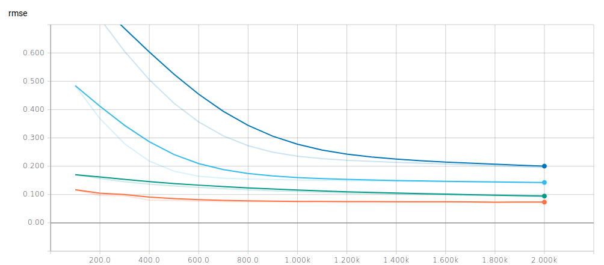

# Energy Regression

The goal is to train a regression model that minimizes the experimental error
associated with the energy reconstruction in the CMS electromagnetic calorimeter.

The results are based on the simulated sample

- `eplus_Ele-Eta0PhiPiOver2-Energy20to100_V2.npy`.

## Baseline

The root mean squared error [RMSE](python/custom_estimator.py#L58) measures
the discrepancy between the reconstructed energy and the generated value.
An initial baseline is:

- RMSE = 0.171

## Machine Learning Models

<table>
  <tr>
    <th>Model</th>
    <th>Total Parameters </th>
  </tr>
  <tr>
    <td><a href="https://github.com/jruizvar/ml-physics/blob/regression/python/custom_models.py#L6-L17">Baseline</a></td>
    <td>2</td>
  </tr>
  <tr>
    <td><a href="https://github.com/jruizvar/ml-physics/blob/regression/python/custom_models.py#L20-L27">Linear Regression</a></td>
    <td>785</td>
  </tr>
  <tr>
    <td><a href="https://github.com/jruizvar/ml-physics/blob/regression/python/custom_models.py#L30-457">Shallow NN</a></td>
    <td>7971 </td>
  </tr>
  <tr>
    <td><a href="https://github.com/jruizvar/ml-physics/blob/regression/python/custom_models.py#L48-83">Convolutional NN</a></td>
    <td>855425 </td>
  </tr>
</table>

The good performance of a convolutional model at minimizing the
[RMSE](python/custom_estimator.py#L58) is demonstrated below.

<table>
  <tr>
    <th colspan="6">RMSE results</th>
  </tr>
  <tr>
    <td>Model \ Energy threshold</td>
    <td>0 GeV</td>
    <td>10 GeV</td>
    <td>20 GeV</td>
    <td>30 GeV</td>
  </tr>
  <tr>
    <td><a href="https://github.com/jruizvar/ml-physics/blob/regression/python/custom_models.py#L6-L13">Baseline</a></td>
    <td>0.134</td>
    <td>0.052</td>
    <td>0.049</td>
    <td>0.056</td>
  </tr>
  <tr>
    <td><a href="https://github.com/jruizvar/ml-physics/blob/regression/python/custom_models.py#L16-L31">Shallow NN</a></td>
    <td>0.133</td>
    <td>0.040</td>
    <td>0.035</td>
    <td>0.033</td>
  </tr>
  <tr>
    <td><a href="https://github.com/jruizvar/ml-physics/blob/regression/python/custom_models.py#L34-L69">Convolutional NN</a></td>
    <td>0.071</td>
    <td>0.039</td>
    <td>0.038</td>
    <td>0.034</td>
  </tr>
</table>

## Learning Curve
The [loss](python/custom_estimator.py#L45) is defined by the mean squared error
between the labels and the model predictions. The horizonal axis represents the
number of [steps](python/custom_estimator.py#L80). One epoch is equivalent to
100 steps.

The blue (orange) curve corresponds to the validation (training) sample.

The evolution of the [RMSE](python/custom_estimator.py#L58) calculated for the
validation sample is shown below.

## TensorBoard Graph

The complete graph associated to the convolutional model is displayed below.

## Python Modules

## [custom_dataset.py](python/custom_dataset.py)
- Create a dataset of training and validation examples with simulations of the
CMS electromagnetic calorimeter.

## [custom_models.py](python/custom_models.py)
- Create models in [TensorFlow](https://www.tensorflow.org).

## [custom_estimator.py](python/custom_estimator.py)
- Build a regression model using
[tf.estimator](https://www.tensorflow.org/api_docs/python/tf/estimator) API.
