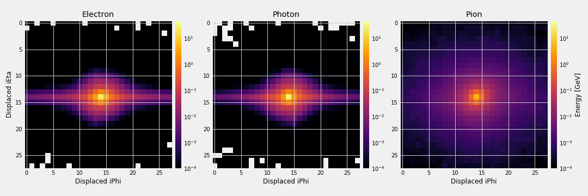

# Crystal Level Identification of Particles with the   CMS Electromagnetic Calorimeter

The real time identification of particles is a challenging problem in high energy physics experiments.
The Compact Muon Solenoid (CMS) detector from the CERN's Large Hadron Collider (LHC) relies on the Electromagnetic
Calorimeter (ECAL) to identify electrons and photons. The primary detection materials of the ECAL are lead-tungstate
(PbWO4) crystals equipped with photodetectors stuck onto the back of each crystal.

The ECAL is composed by a barrel section and two endcaps. The ECAL barrel is a cylinder of 1.3 m inner radius
with 61200 crystals arranged like 170 around x 360 lengthwise. Approximately 94% of the energy from a single particle is
contained in 3x3 crystal towers. Usually, the ECAL information is complemented with other CMS subdetectors to
improve the identification efficiency, at the expense of delaying detection time. Therefore, an accurate identification
of electrons and photons based on pure ECAL information at crystal level would be extremely important for many analyses.

This study aims the identification of electrons and photons by observing, at crystal level, the signature of
these particles in the ECAL barrel. Charged pions are also taken into account as they frequently
arise in LHC collisions. We use a computer vision approach to deal with the analysis of the energy distributions.
Specifically, we solve a supervised classification problem considering three target classes: electron,
photon and pion.

The classification model is based upon an artificial neural network with convolutional layers.
It was trained on a datasets simulated by a particle gun with truth energy of 50 GeV.
On top of the reconstructed energy, we apply different thresholds from 0 to 30 GeV in steps of 10 GeV.
Regardless of the threshold, we ensure 20K examples for training and 20K examples for validation.
The optimization routine was executed in batches of 128 images during 10K steps, for a total of 64 epochs.
As a result, we achieved a classification accuracy of 93% in the best scenario.

<table>
  <tr>
    <th colspan="6">Accuracy Results</th>
  </tr>
  <tr>
    <td>Model \ Energy threshold</td>
    <td>0 GeV</td>
    <td>10 GeV</td>
    <td>20 GeV</td>
    <td>30 GeV</td>
  </tr>
  <tr>
    <td><a href="https://github.com/jruizvar/ml-physics/blob/master/python/custom_models.py#L6-L21">Shallow NN</a></td>
    <td>0.895</td>
    <td>0.903</td>
    <td>0.900</td>
    <td>0.904</td>
  </tr>
  <tr>
    <td><a href="https://github.com/jruizvar/ml-physics/blob/master/python/custom_models.py#L24-L59">Convolutional NN</a></td>
    <td>0.914</td>
    <td>0.933</td>
    <td>0.926</td>
    <td>0.922</td>
  </tr>
</table>

## Python Modules

## [custom_dataset.py](python/custom_dataset.py)
- Create a dataset of training and validation examples with simulations of the CMS electromagnetic calorimeter.

## [custom_models.py](python/custom_models.py)
- Create models in [TensorFlow](https://www.tensorflow.org).

## [custom_estimator.py](python/custom_estimator.py)
- Build a classifier using [tf.estimator](https://www.tensorflow.org/api_docs/python/tf/estimator) API.
