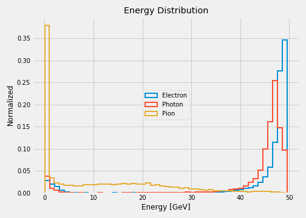

# Electron, Photon and Pion Classification with   Artificial Neural Networks

The real time identification of particles is a challenging problem in high energy physics experiments.
The Compact Muon Solenoid (CMS) detector from the CERN's Large Hadron Collider (LHC) relies on the electromagnetic
calorimeter (ECAL) to identify electrons and photons. Usually, the ECAL information is complemented with
the tracker detector to increase the identification efficiency at the expense of delaying detection time.
An accurate identification of electrons and photons based on pure ECAL information would be extremely
important for many analysis workflows.

This study aims the identification of electrons and photons by simulating the signature of these particles
in the ECAL. Charged pions are included in the simulation as they arise frequently in LHC collisions.
By looking at the energy distribution deposited by electrons, photons and pions, it is easy to set the
pions appart. However, the signatures of electrons and photons are quite similar between themselves.

Our approach to deal with the supervised classification problem is based on artificial neural networks (NN).
The first model under study is a shallow NN with fully connected layers. The second model involves a more complex
architecture based on convolutional layers. As a result, the convolutional NN outperforms the shallow model
in terms of classification accuracy.

Each model is trained on 4 different datasets created by selecting images with total energy above a threshold
that varies from 0 to 30 GeV in steps of 10 GeV. Regardless of the threshold, we ensure 20K examples for training
and 20K examples for validation. The optimization was run in batches of 128 images during 10K steps, for a total of 64 epochs.

<table>
  <tr>
    <th colspan="6">Accuracy Results</th>
  </tr>
  <tr>
    <td>Model \ Energy threshold</td>
    <td>0 GeV</td>
    <td>10 GeV</td>
    <td>20 GeV</td>
    <td>30 GeV</td>
  </tr>
  <tr>
    <td><a href="https://github.com/jruizvar/ml-physics/blob/master/python/custom_models.py#L6-L21">Shallow NN</a></td>
    <td>0.895</td>
    <td>0.903</td>
    <td>0.900</td>
    <td>0.904</td>
  </tr>
  <tr>
    <td><a href="https://github.com/jruizvar/ml-physics/blob/master/python/custom_models.py#L24-L58">Convolutional NN</a></td>
    <td>0.914</td>
    <td>0.933</td>
    <td>0.926</td>
    <td>0.922</td>
  </tr>
</table>

## Python Modules

## [custom_dataset.py](python/custom_dataset.py)
- Create a dataset of training and validation examples with simulations of the CMS electromagnetic calorimeter.

## [custom_models.py](python/custom_models.py)
- Create models in [TensorFlow](https://www.tensorflow.org).

## [custom_estimator.py](python/custom_estimator.py)
- Build a classifier using [tf.estimator](https://www.tensorflow.org/api_docs/python/tf/estimator) API.

